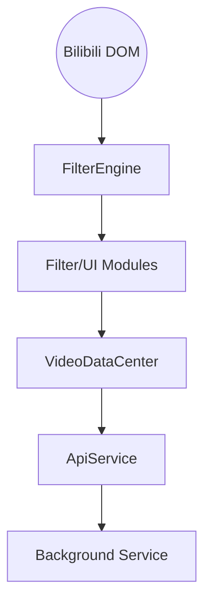

# Bilibili-Enhancer 项目架构

本项目旨在通过 Bilibili 官方 API 和 DOM 增强，提升用户的浏览体验。

## 核心服务

### 1. FilterEngine (`src/services/FilterEngine.ts`)
- **职责**：全站视频过滤中心。
- **机制**：由单一 `MutationObserver` 驱动，识别视频卡片并分发给各功能模块。
- **视觉控制**：集中管理卡片的视觉状态（隐藏、遮罩、透明），处理多重过滤规则的冲突优先级。

### 2. VideoDataCenter- `src/services/DataCenter.ts`: 统一数据缓存中心。
- `src/services/DynamicVideoService.ts`: 动态视频抓取与数据脱敏映射。
- `src/modules/SpaceDynamicModule.ts`: 个人空间增强模块，处理侧边栏注入与动态列表渲染。
- **职责**：全站视频数据中心。
- **功能**：
    - **全局缓存**：为点赞、收藏、分辨率等数据提供单例级别的静态缓存。
    - **并发管理**：实现 In-flight 请求去重，确保同一视频在多处展现时只发起一次网络请求。
- **地位**：作为 `ApiService` 的上层封装，是过滤器和 UI 增强功能的唯一数据入口。

### 3. ApiService (`src/services/api.ts`)
- **职责**：底层通信层。
- **功能**：封装 `chrome.runtime.sendMessage` 与后台脚本（background.ts）进行跨域请求。

## 模块说明

- **InteractionFilterModule**: 利用 `VideoDataCenter` 获取状态，通过 `FilterEngine` 执行隐藏。
- **DurationFilterModule**: 利用本地 DOM 数据，通过 `FilterEngine` 执行隐藏。
- **ResolutionFilterModule**: 利用 `VideoDataCenter` 获取分辨率数据，通过 `FilterEngine` 执行隐藏。
- **ChargingBlockerModule**: 拦截充电专属内容，支持显示角标或视觉遮罩。
- **ThumbnailEnhancerModule**: 在封面图上叠加分辨率、分 P 等元数据角标。

## 数据流向

