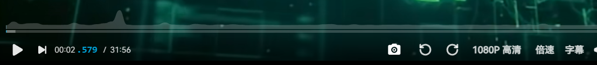
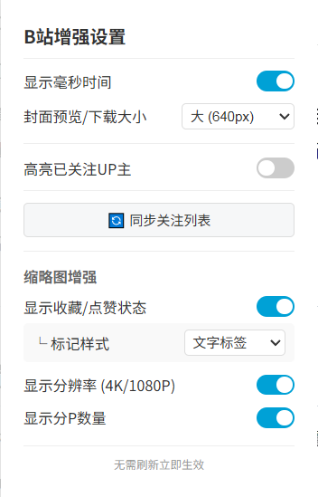

# Bilibili Enhancer (B站增强插件)

基于 TypeScript 和 Manifest V3 开发的 Chrome 浏览器扩展，全方位提升 Bilibili 网页版的使用体验。

它集成了 **缩略图信息增强**、**封面工具箱**、**播放器增强**、**社交关系辅助** 以及 **视频下载与自动化** 五大核心模块。

---

## ✨ 核心功能 (Features)

### 1. 🏷️ 视频缩略图增强
在浏览首页、推荐列表或个人空间时，直接在视频封面上显示关键信息，**无需点击**即可掌握视频状态。

* **状态标记**：自动检测并显示你对该视频的 **“已收藏”** 或 **“已点赞”** 状态。
* **样式切换**：支持 **文字标签** 或 **三角角标** 两种风格，切换时**即时生效**无需刷新。
* **视频信息**：显示视频 **分辨率** (4K/1080P) 和 **分P数量**。
* **屏蔽充电专属**：自动识别并隐藏“充电专属”视频，净化浏览体验。
* **智能加载**：仅请求可视区域内的视频数据，流畅不卡顿。

> **效果预览：**
>
> | 文字标签 | 三角角标 |推荐视频列表 |
> | :---: | :---: | :---: |
> |  |  | |

### 2. 📥 封面预览与下载
* **悬停预览**：在任意视频列表，鼠标指向封面即可在左侧浮现高清大图。
* **一键下载**：在视频播放页工具栏新增 **“封面”** 按钮，点击即可下载高清原图（自动命名）。
* **尺寸统一**：支持 **小/中/大** 三种尺寸设置，预览和下载体验高度统一。

> **效果预览：**
>
> | 列表悬停预览 | 播放页下载按钮 |
> | :---: | :---: |
> |  |  |

### 3. 📺 播放器增强
* **视频旋转**：支持向左/向右 90° 旋转，拯救方向错误的手机投稿。
* **快捷截图**：`Shift + S` 极速截图，自动携带时间戳和 BV 号。
* **毫秒时间**：进度条显示精确到毫秒（如 `03:14.159`），助你精准空降。

> **效果预览：**
>
> 

### 4. 🌟 已关注UP主高亮
在茫茫评论区或推荐流中，一眼认出“自己人”(需先在插件面板点击同步按钮更新关注列表）
* **醒目高亮**：已关注的 UP 主名字显示为 **玫红色粗体**。

> **效果预览：**
>
> 

### 5. 🚀 视频下载与自动化
打通视频下载与收藏的闭环工作流。
* **联动视频下载**：无缝对接 [Bilibili Downloader](https://github.com/kingvamp/bilibili-downloader) 扩展，支持快捷调用进行视频解析与下载。
* **下载后自动收藏**：支持在设置面板自定义配置 **收藏夹 ID**。当视频下载完成后，插件会自动将其加入该指定收藏夹，实现全自动归档。

---

## ⚙️ 设置面板

点击浏览器右上角的插件图标，体验全新设计的现代化设置面板：

* **🎨 卡片式布局**：功能分区清晰，视觉整洁，遵循 B 站原生蓝色调设计。
* **🔘 快捷交互**：封面大小、状态显示等选项采用 **分段控制器 (Segmented Control)**，一键切换，直观高效。
* **⚡️ 即时响应**：所有设置修改后立即保存并生效，无需手动刷新页面。

> **面板预览：**
>
> 

>   
> 

---

## 🛠️ 安装与开发

### 安装方式
1.  下载本项目 Release 页面的 `zip` 包或克隆源码。
2.  打开 Chrome 扩展管理页 `chrome://extensions/`。
3.  开启右上角 **"开发者模式"**。
4.  点击 **"加载已解压的扩展程序"**，选择 `dist` 目录。